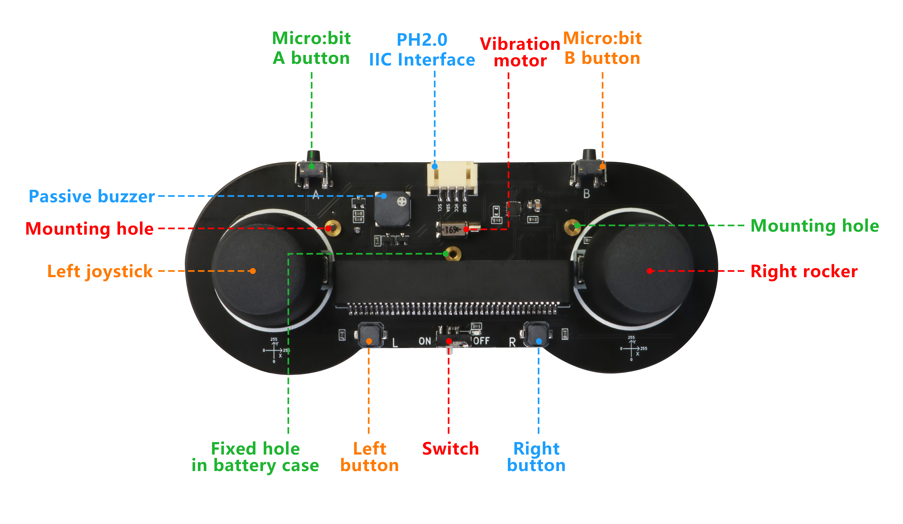

> Open this page at [https://targetarchitecture.github.io/tiger-fancy-joystick/](https://targetarchitecture.github.io/tiger-fancy-joystick/)

Joystick: Bit is a wireless programmable controller developed for Micro: Bit, which is produced by [Shenzhen E-Innovation Space Technology Co., Ltd.](www.emakefun.com) and supports Micro: Bit V1 and V2

https://github.com/emakefun/pxt-joystickbit

Joystick: Bit is a wireless programmable controller developed for Micro: Bit, which is produced by [Shenzhen E-Innovation Space Technology Co., Ltd.](www.emakefun.com) and supports Micro: Bit V1 and V2

## characteristic

- Left and right rockers

- The joypad extends the Microbit A, B buttons

- Left and right programmable independent keys

- Board buzzer and vibration motor

- Powered by 2 # 7 batteries

- 1 PH2.0-4PIN I2C interface

  
  
  

## Graphic programming block description

   - "GamePad Joystick to get left/right X/Y axis values" : This module is used to get the coordinate values of the left or right joystick in the X or Y axis direction. The values obtained are numeric types and can be displayed on the Micro: BIT board through the 'Show Number' module
   - "Game gamepad vibration frequency ()" : This module is used to debug the vibration frequency of the vibration motor on the game gamepad. When its value is 0, the vibration motor stops vibrating.
   - "Key L/R/ left joystick key/right joystick key is pressed/released" : This module is used to determine whether the left and right joystick key and the joystick center key are pressed or released, and it returns true or false, which is used to determine the module (if...Then execute...)
   - "Key L/R/ left joystick key/right joystick key is pressed/released" : This module is used to determine whether the left and right joystick key and the joystick center key are pressed or released, and it returns true or false, which is used to determine the module (if...Then execute...)
   - "Gamepad Button L/R/ Left Joystick Button/Right Joystick Button Released" : This module is used to determine if the joystick button is not held down, if it returns true or if it returns false.

   

   - The following is the meaning of the composite module
     

## Use as Extension

This repository can be added as an **extension** in MakeCode.

* open [https://makecode.microbit.org/](https://makecode.microbit.org/)
* click on **New Project**
* click on **Extensions** under the gearwheel menu
* search for **https://github.com/targetarchitecture/tiger-fancy-joystick** and import

## Edit this project 

To edit this repository in MakeCode.

* open [https://makecode.microbit.org/](https://makecode.microbit.org/)
* click on **Import** then click on **Import URL**
* paste **https://github.com/targetarchitecture/tiger-fancy-joystick** and click import

## Blocks preview

This image shows the blocks code from the last commit in master.
This image may take a few minutes to refresh.

#### Metadata (used for search, rendering)

* for PXT/microbit

